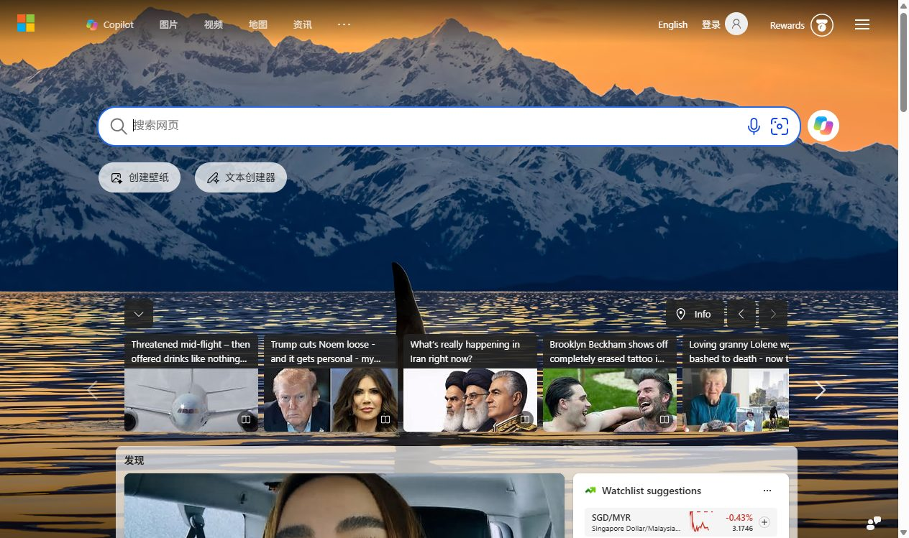

# dsh-plugin-chrome

> DeepSeek Harness 浏览器可视化插件：为每个会话打开一个**真实可见的 Chrome 窗口**，Agent 通过 `chrome_*` 工具集操作浏览器，你在 Web GUI 的「Chrome」标签页里**实时观看画面流**，随时可以手动接管。

| | |
|---|---|
|  |  |

[](https://github.com/jiaererw/dsh-plugin-chrome/stargazers)
[](LICENSE)

[English](README.md)

## 目录

- [特性](#特性)
- [安装](#安装)
- [使用](#使用)
- [Jev 委托模式](#jev-委托模式)
- [配置](#配置)
- [常见问题](#常见问题)
- [开发](#开发)
- [License](#license)

## 特性

- **独立可见窗口**：每个 DSH 会话拥有一个独立 Chrome 窗口（真实窗口、非 headless），用户在旁边就能看到 Agent 的每一步操作；窗口使用隔离的 user-data-dir，与你的日常浏览器互不干扰。
- **实时画面流**：Web GUI「Chrome」标签页通过 Chrome screencast 实时显示页面画面（页面活跃时秒级流畅）；页面静止时由心跳兜底强制截帧（约 2 秒一帧：3 秒无真实帧即触发），画面不会冻结。
- **完整的 Agent 工具集**（16 个工具）：`chrome_open` / `chrome_status` / `chrome_close` / `chrome_navigate` / `chrome_tabs` / `chrome_snapshot` / `chrome_screenshot` / `chrome_click` / `chrome_click_at` / `chrome_fill` / `chrome_type` / `chrome_press_key` / `chrome_hover` / `chrome_scroll` / `chrome_evaluate` / `chrome_wait`。其中 `chrome_tabs` 支持 list / new / close / select；快照、截图与点击始终作用于「当前选中」的标签页。
- **工具卡片会说人话**: 参数不直观的工具 (`chrome_evaluate` 的脚本, `chrome_click_at` 的坐标, `chrome_type` 的按键输入) 额外要求一个必填的 `description` 参数; Web GUI 的工具卡片摘要取参数里的第一个字符串, 于是显示的是「读取商品列表」「点击登录按钮」这类话, 脚本和坐标退到卡片的展开详情里. 16 个工具另外都通过 `presentCall` 声明了自己的卡片意图 (标题与关键参数), 供会渲染它的 DSH 界面使用.
- **无障碍树快照**：`chrome_snapshot` 输出紧凑的 a11y 树 + 稳定元素 uid，点击/填充直接按 uid 定位，比裸 DOM 省 token、抗脆弱选择器。
- **Jev 委托 (可选开启)**: `chrome_jev_run` 把一整段机械浏览器流程 (点击/切换/滚动/安全按键/刷新) 交给 TypeSafe 超廉价决策模型 [Jev](https://docs.typesafe.ai/introduction) (输入 $0.042/1M tokens)——一次工具调用内部完成最多 30 轮 "读状态 → 决策 → 执行", 主模型不再为每次点击消耗回合. 思路来自 [jev-browser-use](https://github.com/wy-coliney/jev-browser-use) (MIT), 本插件在其 CDP 栈上原生实现了同一循环, 协议保持兼容. 默认关闭, 详见 [Jev 委托模式](#jev-委托模式).
- **截图双通道**：`chrome_screenshot` 的图片既进模型上下文（图片块），也保存到会话截图目录并展示在面板里；历史记录带标题/URL/尺寸元数据，重启后仍在。（会话用纯文本模型？请看常见问题。）
- **安全设计**：CDP 不暴露固定端口；Web API 拒绝跨站请求（Sec-Fetch-Site）+ sessionId 白名单校验；浏览器数据按会话隔离。
- **首次启动先经你同意**: 每个会话第一次启动浏览器窗口前会弹一次审批 (走 DSH 原生审批通道, 在 Web GUI 里点「允许一次」), 同意之后该会话内所有 `chrome_*` 调用都不再询问; 拒绝则不启动浏览器, 下次调用会再问一次. 审批弹窗里的理由就是模型写的 `chrome_open.justification` 原文 (该参数必填), 弹窗不会出现插件写死的模板句子; 会隐式开窗的其他工具没带理由时直接失败并提示改用 `chrome_open`. 没有审批通道的部署 (纯 CLI / headless) 自动跳过这一步.
- **资源治理**：空闲自动关闭（默认 10 分钟，可配置），`chrome_close` 显式关闭，插件卸载/宿主退出时全部收尾。

## 安装

> 前置：已安装 DeepSeek Harness（DSH），本机装有 Chrome 或 Edge。

```sh
# 方式一：从 GitHub 安装（推荐）
npx -p @deepseek-ai/dsh dsh plugin --profile web add github:jiaererw/dsh-plugin-chrome

# 方式二：本地路径（开发调试）
npx -p @deepseek-ai/dsh dsh plugin --profile web add D:/harness/dsh-plugin-chrome
```

安装后**重启 DSH**，Web GUI 的会话顶部会出现「Chrome」标签页。

> 若你的 profile 的 `cordis.patch.yml` 里还留着早期本地开发时手动挂载的 `dsh-plugin-chrome` 行，请先删掉再走 CLI 安装，避免双挂载（两个 host 半、两个 Chrome 管理器）。

## 使用

### 给 Agent 用（工具）

安装后 Agent 自动获得 `chrome_*` 工具集。直接对 Agent 说：

> 打开 Chrome，访问 https://example.com，截个图，然后点页面里的「登录」按钮并填写用户名。

Agent 会：`chrome_open` → `chrome_navigate` → `chrome_screenshot`（看图）→ `chrome_snapshot`（拿 uid）→ `chrome_click` / `chrome_fill`。

### 给你看（可视化）

1. 打开会话顶部的「Chrome」标签页：
   - **实时画面**：Live 视图持续显示 Chrome 窗口画面。页面有活动时走 Chrome 原生 screencast 帧流（秒级流畅）；页面静止时由心跳兜底强制截帧（约 2 秒一帧），画面不会冻结。
   - **标签页管理**：右侧列表新建/切换/关闭标签页，与窗口同步。
   - **手动接管**：你随时可以在 Chrome 窗口里自己点几下——Agent 的下一次工具调用会看到你的改动。
2. **截图历史**：每次 `chrome_screenshot` 的产物都在「截图历史」里，点击缩略图放大。

### 窗口生命周期与容错

- **惰性启动**：首次调用任意 `chrome_*` 工具（或点击面板「打开窗口」）时才拉起 Chrome。单纯打开会话里的「Chrome」标签页**不会**启动浏览器，它只附着到已经存在的窗口。
- **接管遗留实例**：若 DSH 进程异常退出留下了孤儿 Chrome（profile 被锁），插件下次启动会通过 `DevToolsActivePort` 自动连接并接管该窗口（借鉴 chrome-devtools-mcp 的 autoConnect 机制），而不是报错。
- **空闲回收**：窗口空闲超过 `idleTimeoutMs`（默认 10 分钟）自动关闭；有 Web UI 观看实时画面时不回收。
- **无可用标签页时自动补页**：所有操作都会先确保存在一个可用的普通标签页，避免「窗口开着但全是 chrome:// 内部页」时的死锁。
- **首次启动的审批**: 任何会真正拉起浏览器的 `chrome_*` 调用 (包括隐式开窗的 `chrome_navigate` / `chrome_snapshot` 等) 在本会话内第一次执行前都会向用户请求一次审批; 同意后窗口启动, 该会话的授权被记住, 之后的调用直接通过. 窗口已经打开时不会询问 (复用窗口无需新授权). 授权只存在内存里, 按会话隔离, 宿主进程退出即失效; 用 `confirmFirstLaunch: false` 可整体关闭.
- **审批理由由模型给**: `chrome_open` 的 `justification` 是必填参数, 审批弹窗直接展示这句话, 所以弹在你面前的是"为什么这个会话需要浏览器"而不是一句插件模板. 会隐式开窗的其他工具 (如 `chrome_navigate`) 没带理由时不会弹审批, 而是返回错误并提示模型改用 `chrome_open` 重试——用户不会遇到一个说不清来意的开窗请求.

## Jev 委托模式

仪表盘, 设置页, 报表这类重复性页面操作, 每一次点击都要消耗一个主模型回合. Jev 模式把整段机械循环装进一次工具调用: 插件抓取页面无障碍状态, 廉价的 Jev 决策模型挑选下一个动作, CDP 执行, 如此往复——单次调用最多 30 步, 主模型只在结束后核验结果. 设计对齐 [jev-browser-use](https://github.com/wy-coliney/jev-browser-use), 状态格式, 端点与契约均与其兼容.

### 工具

| 工具 | 用途 |
| --- | --- |
| `chrome_jev_run` | 运行一段有界的决策/执行循环: `goal` + `allowedOrigins` + `controls` (命名点击, 滚动, 安全按键, 刷新) 和/或自动发现 `policy`. 返回 `needs_verification` (Jev 认为目标已达成——必须独立核验) 或交接状态 (`low_confidence`, `blocked`, `no_progress`, `loading_timeout`, `decision_error`, `action_error`, `budget`, `step_limit`). 执行历史按会话保留, 跨调用可续跑; 传 `reset: true` 清空. |
| `chrome_jev_wait` | 确定性等待: 轮询无障碍状态直到 `includes` 文本全部出现且 `excludes` 文本全部消失 (不消耗 Jev 决策调用). |

### Jev 永远不做什么

不输入文本, 不看截图, 不生成选择器/坐标/URL, 不按白名单以外的键 (仅 Enter/Escape/Tab/Shift+Tab/PageUp/PageDown/Home/End). 打字 (`chrome_fill`/`chrome_type`), 图像判断与最终核验始终由主模型负责, 处理完可以续用同一个 Jev 会话. 页面一旦离开 origin 白名单循环立即终止. `denyNames` / `requireCodexNames` 名单可以把支付, 删除, 发布这类关键控件留给主模型.

### 开启步骤

1. 获取 Jev 访问权限: TypeSafe API key, 或 OpenRouter 的 Decisions 端点 key.
2. 把 key 放进本地 dotenv 文件, 例如 `<dataRoot>/jev-credentials.env` (默认即 `~/.dsh/data/dsh-plugin-chrome/`):

```shell
TYPESAFE_API_KEY=tsk-your-key-here
```

3. 让插件指向该文件——在 profile 的 `cordis.patch.yml` 中配置:

```yaml
- id: dsh-plugin-chrome
  config:
    jevEnabled: true
    jevProvider: typesafe        # 或 openrouter
    jevEnvFile: ~/.dsh/data/dsh-plugin-chrome/jev-credentials.env
```

或直接在插件的设置页里打开 `jevEnabled` 并填写凭据路径 (设置页存储在 DSH home 内, 按 profile 隔离).

密钥只存于 dotenv 文件——绝不进入配置, 聊天或日志. `jevEnvFile` 留空时插件回退到自身数据目录内的 `<dataRoot>/jev-credentials.env` (跟随 DSH home 隔离, 测试实例不会触碰宿主全局配置); `jevModel: ''` 表示用 provider 默认模型 (`jev-latest`).

注意: `chrome_jev_run` 会把页面无障碍文本发送给所配置的 provider. 只在你能接受页面内容发往该端点的会话里开启此模式, 敏感页面请使用合成数据或公开内容.

## 配置

在 profile 的 `cordis.patch.yml` 中覆盖插件行配置（整段 config 替换）：

```yaml
- id: dsh-plugin-chrome
  config:
    headless: false            # 保持 false：可见窗口是本插件的核心
    executablePath: ''         # 留空自动探测 Chrome/Edge；也可指定绝对路径
    idleTimeoutMs: 600000      # 空闲自动关闭（0=禁用）
    windowWidth: 1280
    windowHeight: 900
    screencastFrameSkip: 4     # 实时画面抽帧（1=最流畅）
    screencastQuality: 70      # JPEG 质量 1-100
    maxSnapshotText: 60000     # 单次快照最大字符数
    maxTabs: 16
    confirmFirstLaunch: true   # 会话首次启动浏览器窗口前弹一次审批（false=从不询问）
    extraArgs: ''              # 追加的 Chrome 启动参数
    # Jev 委托 (详见「Jev 委托模式」):
    jevEnabled: false          # 注册 chrome_jev_run / chrome_jev_wait
    jevProvider: typesafe      # typesafe | openrouter
    jevModel: ''               # 留空 = provider 默认 (jev-latest)
    jevEnvFile: ''             # 存放 TYPESAFE_API_KEY / OPENROUTER_API_KEY 的 dotenv 文件
```

发送给 Jev 的页面状态硬上限 24000 字符 (沿用上游 jev-browser-use 的约定): 超出直接让本次运行报错并提示缩小任务, 而不是静默截断, 这样 Jev 与主模型看到的始终是同一份完整状态.

数据目录（浏览器配置与截图）：`~/.dsh/data/dsh-plugin-chrome/sessions/<sessionId>/`（可用 `dataRoot` 覆盖）。

## 常见问题

- **点开 Chrome 标签页没画面**：窗口没在运行时面板就是这个样子——打开标签页本身不会启动 Chrome（避免无意间拉起浏览器），点面板里的「打开窗口」或让 Agent 调用一次 `chrome_open`。窗口运行后确认面板顶部状态点亮起；静止页面由心跳兜底刷新（约 2 秒一帧，3 秒无真实帧即触发），有内容变化时帧率自动提升。
- **第一次调用 `chrome_open` 弹出审批**: 这是本会话首次启动浏览器窗口的用户确认 (详见「窗口生命周期与容错」), 弹窗正文就是模型在 `justification` 里写的理由, 看完再决定点不点「允许一次」; 误点拒绝时窗口不会启动, 让 Agent 再调一次就会重新询问, 或者你自己点面板里的「打开窗口」. 如果 Agent 第一次走的是 `chrome_navigate` 这类隐式开窗的工具, 它会先收到一个"请改用 chrome_open 并给出理由"的错误, 属正常流程.
- **工具卡片摘要看不懂**: 卡片摘要取参数里的第一个字符串, 也就是模型写的 `justification` / `description` (展开卡片能看到脚本或坐标这类裸参数); 描述不理想时直接要求 Agent 把话说清楚即可.
- **Agent 报"未知元素 uid"**：页面已变化，让它重新 `chrome_snapshot`。
- **窗口被我自己关了**：面板状态会显示"窗口未打开"，下次任意 `chrome_*` 工具调用或点击「打开窗口」即可重启。
- **登录态问题**：每个会话的浏览器是独立 profile，登录态不复用日常浏览器；这是隔离设计，如需登录某网站请让 Agent 完成一次登录（session 期间保持）。
- **杀 DSH 后 Chrome 还开着**：孤儿窗口会在下次会话调用时被自动接管，或手动关闭即可；正常关闭 DSH（插件卸载）会连带关闭窗口。
- **截图后纯文本模型不再回复**：`chrome_screenshot` 会把图片作为图片块写入会话历史。如果当前会话的模型不支持图片输入，之后每一轮请求都会以 `UNSUPPORTED_CONTENT: does not accept image input` 被整体拒绝，会话不再响应，重试无效。请给会截图的会话使用支持视觉的模型，或避免在其中调用 `chrome_screenshot`。
- **安装被 pnpm strict-dep-builds 拦截**：在 profile 的 `pnpm-workspace.yaml` 的 `allowBuilds` 中加入 `dsh-plugin-chrome: true` 后重试安装。
- **`chrome_jev_run` 说 Jev 工具未注册**: 该模式默认关闭——在插件配置里设置 `jevEnabled: true` 并重启 DSH.
- **`chrome_jev_run` 报缺少凭据**: `jevEnvFile` 指向的 dotenv 文件 (默认 `<dataRoot>/jev-credentials.env`) 不存在, 或缺少 `TYPESAFE_API_KEY` / `OPENROUTER_API_KEY`. 修好文件即可; 不要把 key 粘到聊天或配置里.
- **`chrome_jev_run` 返回 `needs_verification`**: Jev 仅凭无障碍文本判断目标达成——请用 `chrome_snapshot` / `chrome_screenshot` 独立核验后再下结论.

## 开发

```sh
pnpm install    # 本仓库统一使用 pnpm
pnpm typecheck   # host + client 两个 program
pnpm test        # vitest 单测
pnpm test:e2e    # 真实 Chrome 端到端冒烟 (会弹出可见窗口)
pnpm build       # lib/index.js + lib/index.d.ts (host), lib/client.js + lib/client.d.ts (client bundle)
pnpm watch       # 开发时持续构建; client 变更经 HMR 热更, host 变更需重启 DSH
```

架构：host 半（cordis 插件）用 puppeteer-core 驱动本机 Chrome，注册 `chrome_*` 工具与 `/dsh-chrome/*` HTTP/WS API；client 半（浏览器 bundle）注册 `conversation.view` 的「Chrome」标签页，消费 API 与帧流。画面流 = Chrome 原生 screencast（活动页）+ 截图心跳（静止页兜底）。控制层借鉴 [chrome-devtools-mcp](https://github.com/ChromeDevTools/chrome-devtools-mcp)（CDP 控制、a11y 快照+uid 反查、等待机制、autoConnect 接管）与 [mcp-chrome](https://github.com/hangwin/mcp-chrome)（截图压缩、CDP 坐标输入、会话引用计数）的成熟设计。

## License

MIT
